# Todolist Angular - Legras Kevin

This project was generated with [Angular CLI](https://github.com/angular/angular-cli) version 11.0.1.

# HOW TO INSTALL THE PROJECT

Open a CMD/Terminal console and follow the step below.

**Clone the project :** 
```
$ git clone https://example.com
```

**Go into the project downloaded :**
```
$ cd Todolist_webclient/
```

**Install all the dependencies/libraries :**
```
$ npm install
```

**Start the serveur :**
```
$ npm start
```

Now you are ready to use the TodoList. Go to <http://localhost:4200/>

# MORE THINGS ABOUT ANGULAR PROJECT

Here some usefull command for an angular project

**Create a component :** 
```
$ ./node_modules/@angular/cli/bin/ng generate component xxx_nameComponent_xxx -c OnPush
```

**Install a new library :**
```
$ npm install xxx_library_xxx
```

if you are using Visual Studio Code you can dowload the extension **Debugger for Chrome**. It will help you to follow step by step your action.


# TODOLIST
<p align="center" width="100%">
    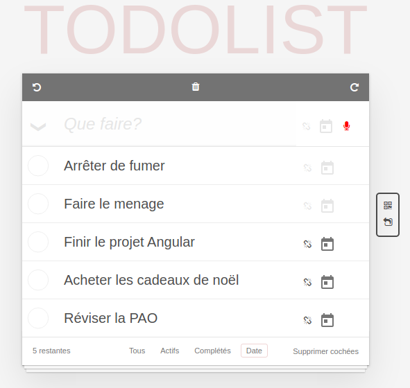
<p>
<p align="center" width="100%">
This is an example of my TodoList . 
<p>

## Functionality

My Todolist includes all the basic fucntionalities and the functions below.

### UNDO/REDO

#### UNDO

This function will erases the last change done to the document, reverting it to an older state.

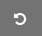 

This button will perform the undo action.

#### REDO

This function will reverses the undo or advances the buffer to a more recent state.

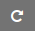 

This button will perform the redo action.

***
### REMOVE ALL

This function will delete all your items from your TodoList.

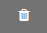 

This button will perform the removeAll action.

***
### Drag&Drop

You can easily move an item from the TodoList to reorder them as you wish.

***

### Select/Unselect all

This function will automatically set all the items to done or not done.

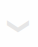 

When the button is on this state all the item will be set as done. 

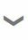 

When the button is on this state all the item will be set as not done. 

***

### Filters

Multiple functions to filter or sort your TodoList.

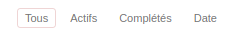 
 
- Tous : Display all the items 
- Actifs : Display only the items still active
- Completés : Display only the item already done 
- Date : Order the items by Date

***
### Voice Recognition

This function will translate spoken words into text. The voice button color will change when he is recording or not.

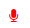 

Your computer is not recording
 
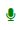 

Your computer is recording

### Source
I impleted a **voice-recognition-service** found on internet <https://codeburst.io/creating-a-speech-recognition-app-in-angular-8d1fd8d977ca>.

***

### Date Picker 

This function will able the user to set a date to an item.

 

This button calendar will display a calendar.

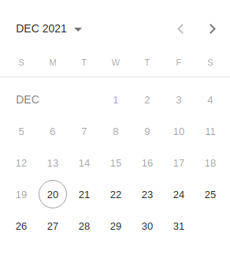 

You are not allowed to set a past date to an item. 

Once you select a date, the button calendar color will change and also the unlink button 

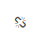

Click on this button to unset the date.

### Source 

I used the library **angular/material** <https://material.angular.io/components/datepicker/api> to implement my datepicker.

### Difficulty 

At the beginning, I got a problem to implement the datepicker as they never mention in the example to import a theme from the library.

    @import '~@angular/material/prebuilt-themes/indigo-pink.css';

I got a lot of issues when i tried to add in the header a function to clear the selection. That's why i added a icon next to the button calendar to unset the date. 

***

### QRcode

This function will display a QRCode to get a copy of your TodoList.

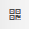

This button will open a popin and display the QRcode

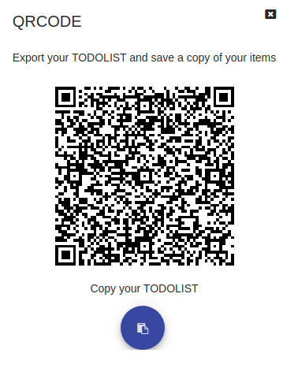

You can scan the qrcode and get the Todolist on your device or directly get copy of it

### Source 

I used the library **angularx-qrcode** <https://www.npmjs.com/package/angularx-qrcode?activeTab=readme>.

I also used the library **angular/material/dialog** <https://material.angular.io/components/dialog/api> for the popin.

***

### Import 

This function will allow you to import a TodoList from another one.

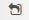

This button will open the popin to import a TodoList

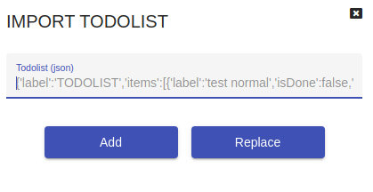

You can add or replace your current TodoList with the json provided. An error message will be display if there was an error during the import.

### Source 

I used the library **angular/material/dialog** <https://material.angular.io/components/dialog/api> for the popin.

***

### FONTAWESOME

i imported the library **font-awesome** for all my icons on the project <https://fontawesome.com/v4.7/>

***

# AUTHOR 

**Legras Kevin**

- <a href="https://github.com/KevinLegras">GitHub/KevinLegras</a>
- <a href="https://www.linkedin.com/in/kevin-legras-058815194/">LinkedIn/KevinLegras</a>
